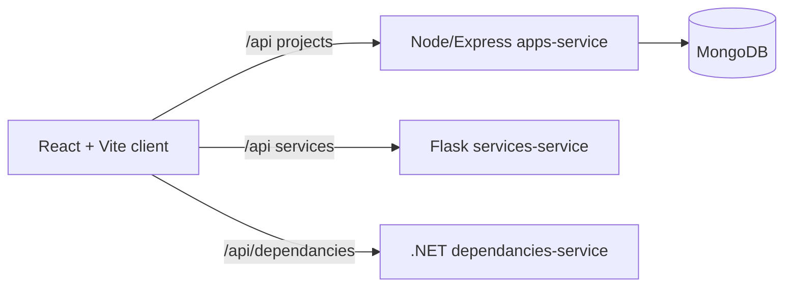

# FullStack Pilot

Minimal React + Node.js + MongoDB starter focused on fast evaluation.

## What this project demonstrates
- **Architecture:** Vite React client, Node/Express API, MongoDB persistence, plus optional Flask and .NET sample services to show polyglot patterns.
- **DevOps:** npm scripts bootstrap and start all Node services; Docker Compose for Mongo; environment-based configuration via `.env` files per service.
- **Quality:** TypeScript on the frontend, ESLint/Prettier defaults, and isolated services with consistent CRUD contracts.

## Architecture (Mermaid)


## Run locally in 2 minutes
1. **Dependencies**
   ```bash
   npm run init:services
   npm run init:client
   ```
2. **Environment**
   ```bash
   cat > services/.env <<'EOF'
   MONGODB_URI=mongodb://localhost:27017/fullstack-pilot
   PORT=4000
   EOF
   ```
3. **Start core stack** (Node API + Mongo + React)
   ```bash
   cd mongo-db && docker compose up -d && cd ..
   npm run start:services
   cd client && npm run dev -- --host
   ```
   Frontend: `http://localhost:5173` (proxies `/api` to Node). API: `http://localhost:4000/api`.
4. **Optional extras**
   - Flask: `npm run start:services-service` (defaults to `http://localhost:5000/api`).
   - .NET: `npm run start:dependancies-service` (routes under `/api/dependancies`).

## Project structure
- `client/` – React UI built with Vite.
- `services/` – Node/Express services (main `apps-service` uses MongoDB).
- `services-service/` – Flask CRUD sample.
- `dependancies-service/` – .NET 8 CRUD sample.
- `mongo-db/` – Docker Compose for local MongoDB.

## API overview (apps-service)
- `GET /api/projects` – list projects
- `POST /api/projects` – create a project. Body: `{ "name": "My project" }`
- `DELETE /api/projects/:id` – delete a project by id

## Roadmap
Use [GitHub Issues](https://github.com/AndrewHulme/fullstack-pilot/issues) as the living backlog and evaluation checklist.

## What I would do next for production
- Add CI (lint, type-check, tests) plus container builds and image scanning.
- Implement seed data and e2e smoke tests for the React + API flow.
- Harden config: secrets from vault, per-env manifests (Helm/Kustomize), health checks.
- Add auth (JWT) and request logging/metrics for all services.
