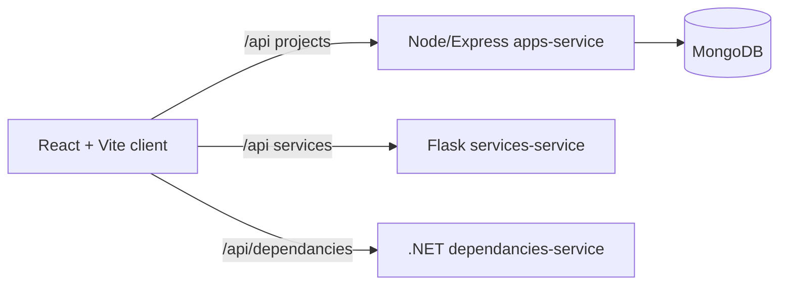

# FullStack Pilot – a full-stack starter that feels production-ready

[](https://github.com/koydas/fullstack-pilot/actions/workflows/build-frontend.yml)
[](https://github.com/koydas/fullstack-pilot/actions/workflows/build-backend.yml)
[](https://github.com/koydas/fullstack-pilot/actions/workflows/mongo-db.yml)

A showcase repository ready to demo end-to-end skills: React (TypeScript) on the UI, a Node/Express + MongoDB core API, plus bonus Flask and .NET microservices to illustrate a polyglot environment. Everything is scripted to launch in minutes, so you can focus on telling the product story.

## Why this repo gets attention
- **Candidate-to-production flow**: initialization scripts for dependencies, a single `docker compose up --build` to bring up the full stack, configured proxies, and smoke tests for every service.
- **Credible architecture**: Vite frontend, Node/Mongo API, Python/.NET services behind dedicated routes, and a mermaid data-flow overview.
- **Review-ready defaults**: ESLint/Prettier, TypeScript on the client, consistent CRUD contracts, and per-service `.env` configuration.
- **Fast demo path**: project CRUD on MongoDB reachable via `/api/projects` and the UI.

## Architecture at a glance


## Quick start
1. **Install Node dependencies**
   ```bash
   npm run init:services
   npm run init:client
   ```
2. **Create the environment file**
   ```bash
   cat > services/.env <<'EOF'
   MONGODB_URI=mongodb://localhost:27017/fullstack-pilot
   PORT=4000
   EOF
   ```
3. **Start the core stack** (Node API + Mongo + React)
   ```bash
   cd mongo-db && docker compose up -d && cd ..
   npm run start:services
   cd client && npm run dev -- --host
   ```
   - Frontend: http://localhost:5173 (proxy `/api` → backend)
   - Node API: http://localhost:4000/api
4. **Optional services**
   - Flask: `npm run start:services-service` (`http://localhost:5000/api`)
   - .NET: `npm run start:dependancies-service` (routes `/api/dependancies`, Swagger: `http://localhost:6060/swagger`)

### One-command launch
```bash
docker compose up --build
```
Exposes: frontend (5173), Node API (4000), Flask API (5000), .NET API (6060), MongoDB (27017).
Rebuild after changes with `docker compose up --build`. Stop with `docker compose down`.

## Directory tour
- `client/` – React + TypeScript UI built with Vite.
- `apps-service/` – Node/Express API connected to MongoDB.
- `services/services-service/` – Flask CRUD service.
- `services/dependancies-service/` – .NET 8 CRUD service.
- `mongo-db/` – docker-compose for local Mongo.

## Primary API (apps-service)
- `GET /api/projects` – list projects
- `POST /api/projects` – create a project `{ "name": "My project" }`
- `DELETE /api/projects/:id` – delete by id

## Ready-made smoke tests
Each service includes a self-contained POST → GET → DELETE script (see [.devops/tests/smoke](.devops/tests/smoke/README.md)). Run them once the service is up:
- Node/Mongo: `./scripts/api-smoke.sh` (env override: `APPS_API_URL` or `API_URL`)
- Flask: `./scripts/services-smoke.sh` (override: `SERVICES_API_URL`)
- .NET: `./scripts/dependancies-smoke.sh` (override: `DEPENDANCIES_API_URL`)

## Deploying to production
- Point `MONGODB_URI` to your managed cluster.
- Build the frontend: `cd client && npm run build`, then serve `dist/` behind your reverse proxy pointed at the API.
- Recommended next steps: CI (lint, type-check, tests), seeds + UI/API E2E, vaulted secrets, healthchecks, JWT auth, centralized logging/metrics.

## Roadmap
The backlog and evaluation checklist live in [GitHub Issues](https://github.com/AndrewHulme/fullstack-pilot/issues).
