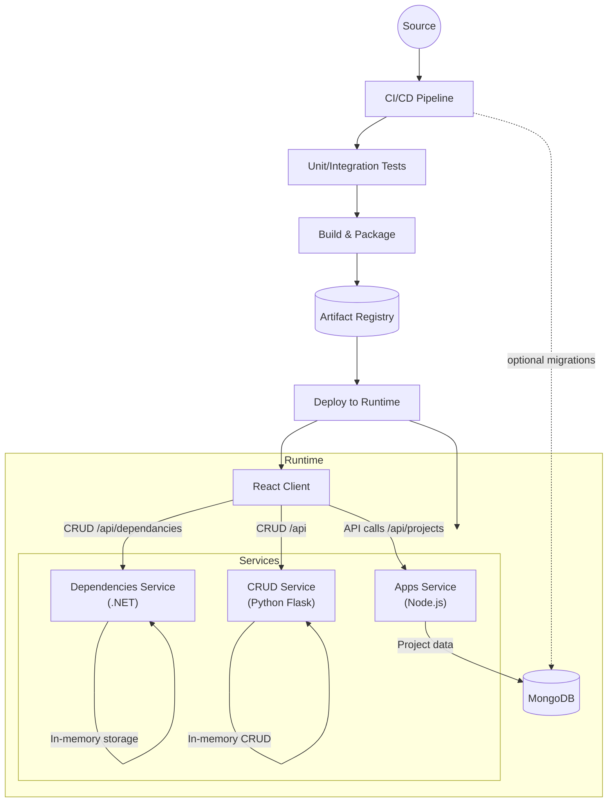

# Architecture Overview

The diagram highlights how the React client communicates with independently deployable backend services, with the Node.js apps service persisting project data in MongoDB. CI/CD automates testing, packaging, and deployment of the client and services to a shared runtime environment.
