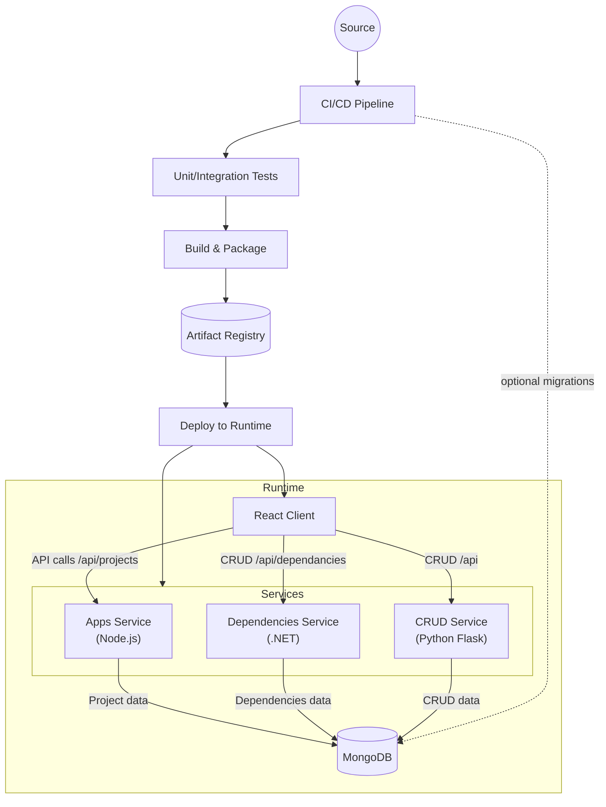

# Architecture Overview

The diagram highlights how the React client communicates with independently deployable backend services. Each service now persists its domain data in MongoDB, providing consistent durability across the stack. CI/CD automates testing, packaging, and deployment of the client and services to a shared runtime environment.
