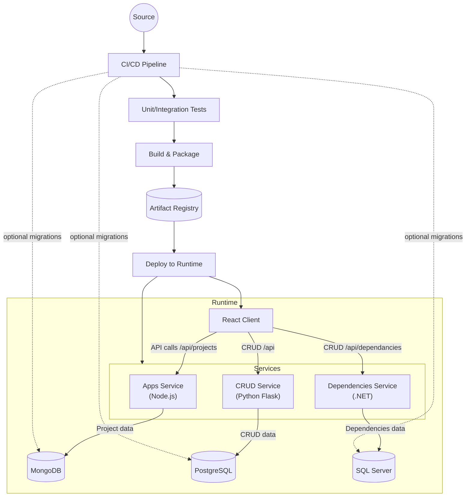

# Architecture Overview

The diagram highlights how the React client communicates with independently deployable backend services. Each service persists its domain data in a database engine aligned with its stack (MongoDB for the Node.js service, SQL Server for the .NET service, and PostgreSQL for the Python service), providing durable storage while keeping services decoupled. CI/CD automates testing, packaging, and deployment of the client and services to a shared runtime environment.
